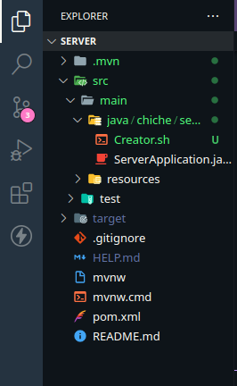
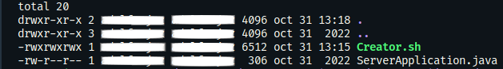
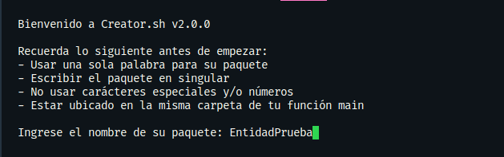
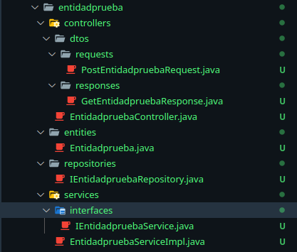
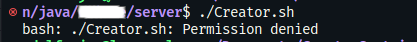
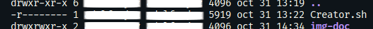
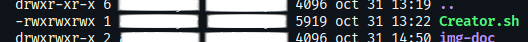

# Creator . sh v 2.0.0
Creator . sh es script en **GNU bash** para crear la estructura inicial una **API REST** para **Java**.

## Limitaciones
La principal limitación es que está desarrollado para sistemas **UNIX**, específicamente para **Linux**.

Aun no ha sido probado en sitemas **MacOs**, ni en el bash de git para sistemas **Windows**.

No es configurable para seleccionar qué componentes usar, y al ser una herramienta de trabajo personal, es muy inestable y fácil de romper.

Para usarlo de manera adecuada, ve a la sección de [**Uso**](#uso) en este mismo documento.

## Uso
Este script solo funciona con proyectos con **Springboot**.

1. Ve a [Spring Initializr](https://start.spring.io/) y crea un proyecto nuevo.
   
2. Añade las dependencias necesarias, o añadela después.
   
3. Descomprime tu archivo, si no añadiste tus dependencias en el paso anterior, reemplaza las dependencias de tu archivo **pom.xml** con las de la [siguiente sección](#dependencias).
   
4. Descarga el script [**Creator.sh**](#) 
   
5. Mueve tu script a la carpeta donde se encuentra tu función main, usualmente en **/src/main/java/.../.../AlgoApplication.java**

6. Abre tu **Terminal** y dirígete al directorio dónde se localiza el script. Al hacer `ls -la` deberá verse lo siguiente: 

7. Ejecuta `./Creator.sh` en tu terminal y da el nombre a tu entidad:

**Importante:** Usar solo una palabara para el nombre de la aplicación, no usar números, carácteres especiales o letras espaciales. El Script transforma la entrada a minúscula para la creacion de las carpetas y solo capitaliza la primera letra para las clases.

8. Una vez finalizado el script, te creará una estructura similar a la siguiente 

.
   
En caso de algún error, checa nuestra secciones de [errores comunes](#errores).

## Dependencias
Para que el código funcione perfectamente, copia las siguientes dependencias dentro de tu **pom.xml** en tu proyecto.

	<dependency>
		<groupId>org.springframework.boot</groupId>
		<artifactId>spring-boot-starter-data-jdbc</artifactId>
	</dependency>
        
	<dependency>
		<groupId>org.springframework.boot</groupId>
		<artifactId>spring-boot-starter-web</artifactId>
	</dependency>

	<dependency>
		<groupId>org.springframework.boot</groupId>
		<artifactId>spring-boot-devtools</artifactId>
		<scope>runtime</scope>
		<optional>true</optional>
	</dependency>
        
	<dependency>
		<groupId>org.springframework.boot</groupId>
		<artifactId>spring-boot-starter-test</artifactId>
		<scope>test</scope>
	</dependency>
        
	<dependency>
		<groupId>mysql</groupId>
		<artifactId>mysql-connector-java</artifactId>
		<version>8.0.30</version>
	</dependency>
        
	<dependency>
		<groupId>org.springframework.boot</groupId>
		<artifactId>spring-boot-starter-data-jpa</artifactId>
		<version>2.6.6</version>
	</dependency>
        
	<dependency>
		<groupId>io.jsonwebtoken</groupId>
		<artifactId>jjwt-jackson</artifactId>
		<version>0.11.2</version>
		<scope>runtime</scope>
	</dependency>
        
	<dependency>
		<groupId>io.jsonwebtoken</groupId>
		<artifactId>jjwt-api</artifactId>
		<version>0.11.2</version>
	</dependency>
        
	<dependency>
		<groupId>io.jsonwebtoken</groupId>
		<artifactId>jjwt-impl</artifactId>
		<version>0.11.2</version>
		<scope>runtime</scope>
	</dependency>
        
	<dependency>
		<groupId>org.apache.commons</groupId>
		<artifactId>commons-lang3</artifactId>
		<version>3.11</version>
	</dependency>
        
	<dependency>
		<groupId>org.springframework.boot</groupId>
		<artifactId>spring-boot-starter-validation</artifactId>
		<version>2.7.3</version>
	</dependency>

	<dependency>
		<groupId>org.projectlombok</groupId>
		<artifactId>lombok</artifactId>
		<version>1.18.24</version>
		<scope>provided</scope>
	</dependency>

## Errores
Recuerda que este una herramienta de desarrollo personal, por lo tanto, es demasiado fácil de romper, sin embargo hay errores con los que podemos ayudar:

### Permiso denegado
Output: `bash: ./Creator.sh: Permission denied` 

**Solucion**: 
Verifique que el archivo [**Creator.sh**](#) tenga los permisos necesarios, para ello ejecute
`ls -la`

Y si el output es similar al siguiente

Ejecute 
`chmod 777 Creator.sh`

Y vuelva a verificar con `ls -la`

y el output deberá verse de la siguiente forma:

### No se ha podido encontrar el directorio Java
output: `No se ha podido encontrar el directorio Java`

**Solución:** Comprueba que el archivo [**Creator.sh**](#) está a la altura del ***project*Application.java**.

El arbol debe verse algo así:

